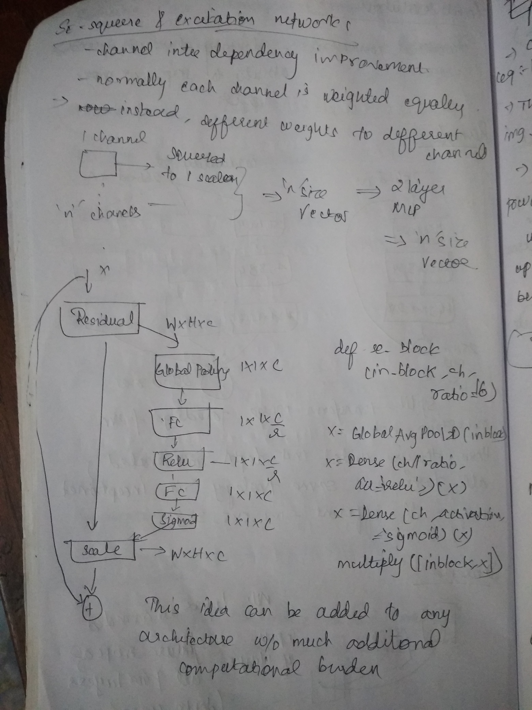
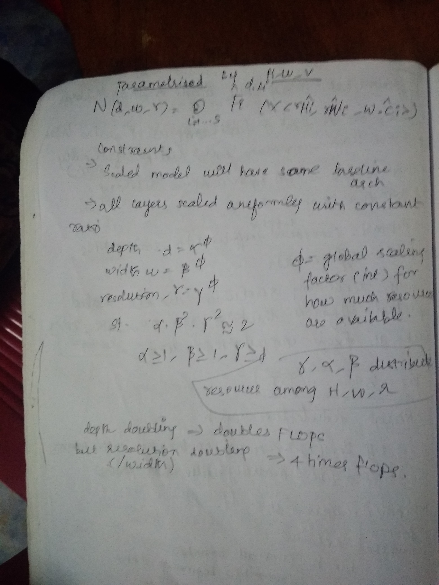

## Model Architectures

### Transformer architectures
- [Illustrated Transformers](http://jalammar.github.io/illustrated-transformer/)
- [medium post on Tranformers](https://medium.com/inside-machine-learning/what-is-a-transformer-d07dd1fbec04)
- [Google AI blog](https://ai.googleblog.com/2017/08/transformer-novel-neural-network.html)
- [Medium post](https://towardsdatascience.com/attention-is-all-you-need-discovering-the-transformer-paper-73e5ff5e0634)
- [Vision transformers](https://towardsdatascience.com/are-you-ready-for-vision-transformer-vit-c9e11862c539)

### Resnet architectures and variants
- [Simple google search](https://www.google.com/search?q=resnest+vs+resnet&oq=resnest+vs+resnet&aqs=chrome..69i57.8285j0j1&sourceid=chrome&ie=UTF-8)
- [efficientnet vs resnet](https://www.google.com/search?sxsrf=ALeKk036AhcaMIAokeRmDgNNIimBiwpANA%3A1610412708874&ei=pPL8X-3rNIOO4-EPq4qzyAU&q=efficientnet+vs+resnet&oq=efficie&gs_lcp=CgZwc3ktYWIQAxgBMgsIABCxAxDJAxCRAjIECAAQQzIFCAAQkQIyBwgAELEDEEMyBAgAEEMyBwgAELEDEEMyAggAMgIIADICCAAyAggAOgQIABBHOgQIIxAnOggIABDJAxCRAjoICAAQsQMQgwE6DgguELEDEIMBEMcBEKMCOggILhCxAxCDAToFCAAQsQNQ7pUBWMSfAWDRqgFoAHAEeAGAAaYCiAGkBpIBBTYuMC4xmAEAoAEBqgEHZ3dzLXdpesgBCMABAQ&sclient=psy-ab)
- For more indepth review of Resnet architecture, refer to [plain-vs-residualnet.ipynb](resnet/plain-vs-residualnet.ipynb) and [resnet.ipynb](resnet/resnet.ipynb)

Resnet vs Resnext
- 

Squeeze and excitation network
- 

EfficientNets
- 
- 

### Graph neural networks

https://distill.pub/2021/understanding-gnns/#learning
https://distill.pub/2021/gnn-intro/
https://distill.pub/2020/selforg/
https://www.youtube.com/watch?v=zCEYiCxrL_0
https://www.youtube.com/watch?v=me3UsMm9QEs
https://www.youtube.com/watch?v=fOctJB4kVlM

conway's game of life

## Loss functions
- Cross Entropy ???
- label smoothing CE ???
- Bitempered logistic loss function ???
- Focal loss function ???
- Taylor loss function ???

## miscellaneous
- [snapshot learning and cyclic lr](https://www.kaggle.com/c/tgs-salt-identification-challenge/discussion/65347)
- [MoA 1st place solution](https://www.kaggle.com/c/lish-moa/discussion/201510#1102840)
- [forward selection ensemble method](https://www.kaggle.com/cdeotte/forward-selection-oof-ensemble-0-942-private)

## ML 
### linear regression scikit-learn package
- sklearn.linear_model.LinearRegressn() class is supervised
reression tdhnique an it can be used ot fit lines to inpu data

- `r2 score (coefficeint of Dteremination` is measure of how well
the model has fit the input data. Its general range is [0,1] but 
it can get negative values also. 
- `r2_score = 1 - SS_res / SS_total` where 
    - SS_total is the sum of squared differences b/w mean of target 
    variable and target variable itself
    - SS_res is the sum of squared fiference b/w predicted and 
    target variables
    - [Reference](https://en.wikipedia.org/wiki/Coefficient_of_determination)

## Resources 
- [Practical ML](https://c.d2l.ai/stanford-cs329p/index.html)
- [Yannic kilcher](https://www.youtube.com/c/YannicKilcher/playlists)
- [Kaggler](https://www.youtube.com/channel/UCI8Y-po83Y4LLnIdAe_cmNA)
- [fastai](https://www.youtube.com/channel/UCX7Y2qWriXpqocG97SFW2OQ)

## Tools
### Pytorch lightning
- [Tensorboard in PT-L](https://learnopencv.com/tensorboard-with-pytorch-lightning/)

## Training techniques
### Learning rate finder
- [LR range test blogpost](https://sgugger.github.io/how-do-you-find-a-good-learning-rate.html)

### LR schedulers
- https://www.jeremyjordan.me/nn-learning-rate/
- [Cosine Annealing - Papers with code](https://paperswithcode.com/method/cosine-annealing)
- [Medium post on SGDR](https://towardsdatascience.com/https-medium-com-reina-wang-tw-stochastic-gradient-descent-with-restarts-5f511975163)

- With Higher learning rates, learning is faster (good until we start diverging)
- As we train longer, we tend to approach global minima, so need to reduce lr. Annealing is the part where we train with lower lr to find stable region (envisioned as plateau, where small changes in input doesnt lead to much change in loss function).
- Cyclic Learning rates - start from one end of sprectrum and increase / decrease the lr using a linear / exp / cosine like function
- warm restarts - Periodically Reseeting lr to lr_max helps us avoid `overfitting regions`, `saddle points`. Warm refers to the point that we continue to use the weights obtained after training for some time and not starting from some pre-defined initialization (random, zero etc)
- lr_max is found using the lr_range test proposed by Leslie Smith. 
- Two major options 
	- Cosine Annealing with warm restarts (Cosine is more aggressive annealing strategy)
	- One cycle lr (across the entire training cycle - linear / cosine annealing)
	- Generally One cycle lr is less over fitting than Cosine Annealing with warm restarts

- **Lower Batch size has a regulaizing effect (less generalization error); CON - higher training time**
- **SGD converges little slower but Adam is fast and overfits a litte**
- **SWA is a method to kinda average the model as it approaches minima, SGD often settles around the local minima but takes longer to find it**
- **Transformers work well - Attention is all you need paper**

### Optimizers
- [Comparison of different Optimizers and lr_schedulers](https://medium.com/vitalify-asia/whats-up-with-deep-learning-optimizers-since-adam-5c1d862b9db0)
- SGD with momentum and wieght decay, Warm restarts is generally SOTA, but takes more time to converge compared to Adam
- SGD with Stochastic Weighted averaging gives better results 
- Adam converges faster but overfits lightly, different variants available - 
- AdamW ???
- Ranger ???

### Image Augumentation techniques
- [Rand augument](https://github.com/ildoonet/pytorch-randaugment)
- [Cutmix, Mixup, gridmask kaggle post](https://www.kaggle.com/saife245/cutmix-vs-mixup-vs-gridmask-vs-cutout)
- [Cutmix and mixup on GPU/TPU by cdeotte](https://www.kaggle.com/cdeotte/cutmix-and-mixup-on-gpu-tpu)
- [GPU augumentations kaggle post](https://www.kaggle.com/c/flower-classification-with-tpus/discussion/132935)

## Validation strategy
### CV strategy
- [k-fold vs stratified kfold](https://www.google.com/search?q=when+to+use+kfold+and+when+to+use+stratified+k+fold&oq=when+to+use+kfold+and+when+to+use+stratified+k+fold&aqs=chrome..69i57.12117j0j1&sourceid=chrome&ie=UTF-8)
