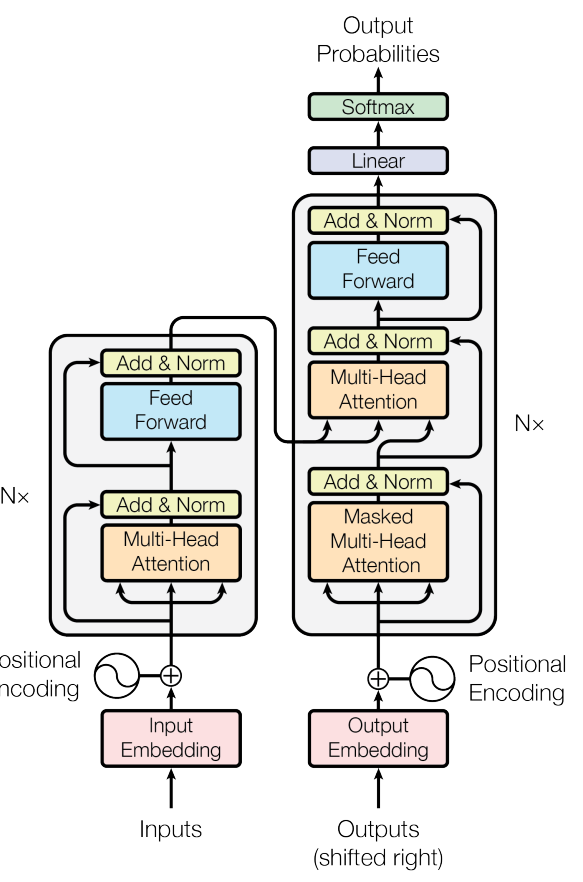
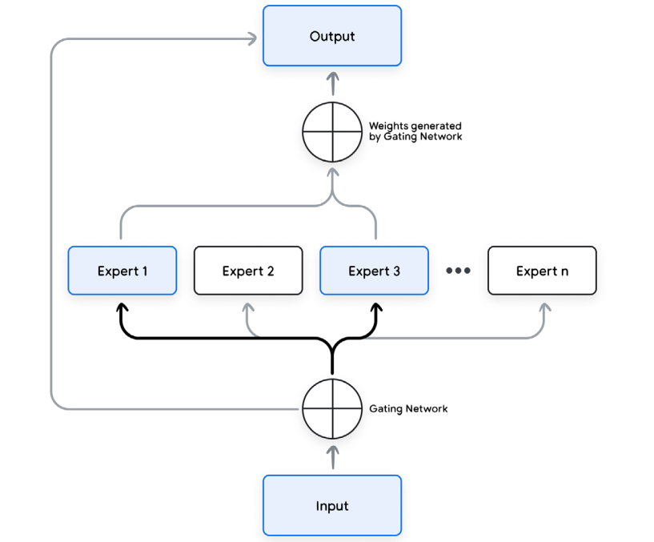

# Foundational Large Language Models & Text Generationh

- This document contains personal notes from [whitepaper](https://drive.google.com/file/d/1rYu-mIcsTrAeCuH-xHPofrI1i1qNVzqO/view), which is part of [Kaggle GenAI course](https://www.kaggle.com/learn-guide/5-day-genai)
- Note: This document covers only "relevant" topics from personal understanding, and not a summary of the course / whitepaper itself

## LLMs
- LLMs are AI systems, that specializes in proessing, understanding and generating human-like text
- Implemented as DL network and requires >> data for training

## LLMs Journey
- LLMs are based on Transformers
- Prior to Transformers, RNNs and LSTMs were used for NLP tasks. They processed data sequentially
- [LSTM working reference](https://colah.github.io/posts/2015-08-Understanding-LSTMs/)
- Sequential processing makes them compute intensive and hard to parallelize during training. Performance detoriaetes with longer inputs
- Transformers can process input token sequences in parallel - scales well to parallelization better, can handle long term dependencies better. **Cost of self-attention is quadratic in context length; which limits context window size**

### Transformers
- [Attention Is All You Need](https://arxiv.org/abs/1706.03762)
- Original transformer architecutre contains encoder-decoder. Encoder uses the input to generate representation, which is passed onto decoder. **Output is linear in length compared to input**

- Following sections explain lifecyle of training Transformer models for Machine translation task

#### Input preparation and embedding
Embedding is high dimensional vector representation of each input token. Generating embedding from input involves following steps
1. Normalization (Optional): Standardizes text by removing redundant whitespace, accents, etc.
2. Tokenization: Breaks the sentence into words or subwords and maps them to integer token IDs from a vocabulary.
3. Embedding: Converts each token ID to its corresponding high-dimensional vector, typically using a lookup table. These can be learned during the training process.
4. Positional Encoding: Adds information about the position of each token in the sequence
to help the transformer understand word order.

#### Multi-head self-attention
- Core idea of transformer architecture
- Self-attention helps model focus on specific parts of input sequences, relevant to task at hand, and handle long range dependencies
- Eg sentence: "The tiger jumped out of a tree to get a drink because it was thirsty."
- Model understands that "Tiger" and "it" refer to same object, through Query, Key, Values (learning Wq, Wk, Wv matrices for each input token)
    - Query: The query vector helps the model ask, “Which other words in the sequence are
relevant to me?”
    - Key: The key vector is like a label that helps the model identify how a word might be
relevant to other words in the sequence.
    - Value: The value vector holds the actual word content information.
- Attention scores are calculated using dot product cosine similarity b/w tokens (query and key)
- scores are normalized and divided by dk (length of attention vector) and softmax-ed
- Output is weighted sum of normalized scores and values
- Multi-head self attention helps model learn 
    -   compltext language patterns, long range dependencies
    - multiple interpretations of input

#### Layer normalization and residual connections
- Layer normalization reduces covariate shift and improves gradient flow, for faster convergence
- Residual connections for easier learning, deal with vanishing and exploding gradients

#### Feedforward layer
- Position wise independent transformation of data, for additional non-lineariry and compltexity
- 2 Linear transforms with 1 Non linear activation - ReLU or GeLU

#### Encoder and Decoder
- Positional encodings are added to embeddings to retrain sequence order information
- Decoder layers employ two types of attention - maske self attention and encode decoder crosoo attention
- Masked self-attention ensures that each position can only attend to earlier positions in the output sequence, preserving the **auto-regressive property**. This is crucial for preventing the decoder from having access to
future tokens in the output sequence. The encoder-decoder cross-attention mechanism allows the decoder to focus on relevant parts of the input sequence, utilizing the contextual embeddings generated by the encoder.

#### Latest developments
Majority of recent LLMs adopted a decoder-only variant of transformer architecture. This approach forgoes the traditional encoder-decoder separation, focusing instead on directly generating the output sequence from the input. The input sequence undergoes a similar process of embedding and positional encoding before being fed into the decoder. The decoder then uses masked self-attention to generate predictions for each subsequent
token based on the previously generated tokens. This streamlined approach simplifies the architecture for specific tasks where encoding and decoding can be effectively merged.

### Mixture of experts (MoE)
- Architecture that combines multiple specialized sub=models (the epxerts) to improve performance
- form of ensemble nearing with a difference, instead of aggregating predictions of all epderts, it learns to route different parts of input to difference experts. Essentially, only part of the network are activated (**Sparse activation**) for given input, reducing compuattion

#### experts
- indivudual sub-models designed to handle specific subsetr of input data or particular task, typically transformer based models

#### Gating network (router)
- learns to route the input to appropriate expert. Takes input and produces probability distribution over the xerpts - how much each expert should contribute to output. This is also typically a neural network

#### Combination mechanmisn
- Combines output of experts, weighted by probabilities from gating network (weighted average)

## Large Reasoning models
- Achieving Robust reasoning capabilities in LLMS invovles - architecture desing, training methodologies, prompting strategies
- **Inducative biases that favour reasoning-conductive patterns**
- Transformer architectures are Foundational, but not vanilla models sufficient
- **Chain-of-Thought** prompting explicitly encourages the model to generate intermediate
reasoning steps before arriving at a final answer.
    - model learns to break task into sub-task
    - mimics human reasoning
- **Tree-of-Thoughts** takes this further, exploring multiple reasoning paths and using a search algorithm to find the most promising solution
- **Fine-tuning** on datasets specifically designed for reasoning tasks is also crucial
- **Instruction tuning**, where the model is trained to follow natural language
instructions, further enhances its ability to understand and respond to complex reasoning
prompts. 
- **Reinforcement Learning from Human Feedback (RLHF)** refines the model’s outputs
based on human preferences, improving the quality and coherence of its reasoning. RLHF
helps in reward models that score reasoning ability as well as “helpfulness.”
- **Knowledge distillation** to transfer knowledge from larger teacher model to smaller more defficient stufent model
- Inference optimization techniques
- Temperature scaling to adjust the randomness of output
- **External data sources** like RAG, where model retrieves and processes relevant information before generating an output

## Training the Transformer

## Potential topics for further reading
- [What Is Mixture of Experts (MoE)? How It Works, Use Cases & More](https://www.datacamp.com/blog/mixture-of-experts-moe)
