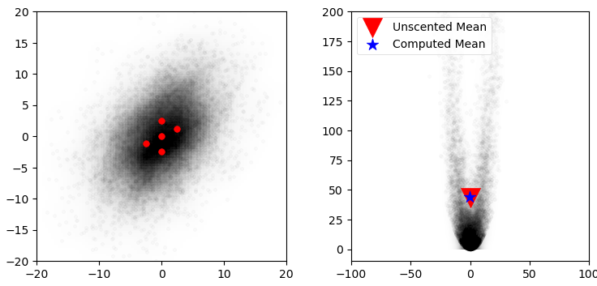
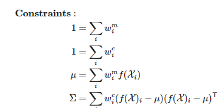
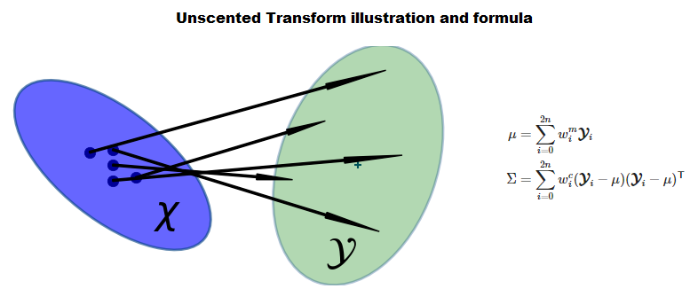
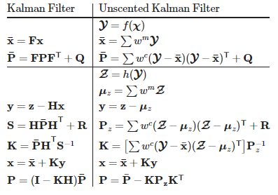
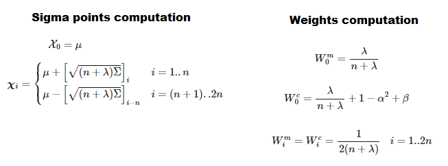

## Unscented Kalman Filters
- Unscented Kalman filters (UKF) are a recent development in Kalman filter theory. They allow you to filter nonlinear problems without requiring a closed form solution like the Extended Kalman filter requires.
- [Chapter 10 Notebook](https://github.com/rlabbe/Kalman-and-Bayesian-Filters-in-Python/blob/master/10-Unscented-Kalman-Filter.ipynb)

## Points to remember
- Pg:343: Monte carlo approach for any NL problems But. num points >>>
- Smart way of choosing sigma points = sampling from distribution

- Pg:347-348. Intuition for choosing (2n+1) points , symmetry & mean. Constraints on points weights. intuition behind sigma pts vis.

- Pg:349-350: Very basic example of unscented Transform, Viz

- Pg:351-352: UKF equations for any sigma pt method, update + predict step.

- Pg:353-359: Van der merwe sigma point selection formula

- Pg:358 Tracking an airplane problem setting up
- Pg:359: NL update functions, **angle wrapping (NL) Implementation problem**
- Pg:367: Why complementary sensors give better results in SF?
- Pg:370-372 Geometry affects 2 bearing sensor fusion
- Pg:373 + Cholesty decomposition in np.outer usage in matrix square roots
- Pg:380-381 Choosing sigma points pta in Varder Merwe method
- **Pg 384-390 Robot localisation problem. UKF solution particularly handling NL among angles in h(x), f(x), sigma points and and finding weighted mean, cov**
- Pg : 391 : Pros of UKF over EKF. This is Van der Merw's versio of Julier's uncscneted transform
