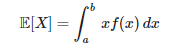
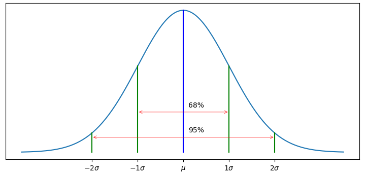

## Probabilities, Gaussians, and Bayes' Theorem
- Introduces using Gaussians to represent beliefs in the Bayesian sense. Gaussians allow us to implement the algorithms used in the discrete Bayes filter to work in continuous domains.
- [Chapter 3 Notebook](https://github.com/rlabbe/Kalman-and-Bayesian-Filters-in-Python/blob/master/03-Gaussians.ipynb)

## Points to remember
- Goal of chapter is to have basis of filter to be continous, unimodal (applicant to many tracking, filtering problems)
- Pg:88, Random variable (RV), if O/P of event has multiple outcomes each with own prob, it constitute an RV. Discrete/ cont. based on sample.
- Pg:89-90 **Measure of central tendency (mean, median, mode)**
- Pg:90 E[X] = Expected vales of Random variable average Value on infinite no. of trials. If all values have equal, Prob then E[x] = mu[x]. For continous probability distribution

- Pg:92- Var[x] = how much values are for from mean. Variation among values themselves. Variance is affected by outliers. Variance's unit is "squared unit". Might not be easy to infer, hence, std.deviation -> same unit as the state member variable. 1 sigma => 68% of all values lie within one standard deviation of the mean.
- In general, when designing products (for example, desks; average height of men, will be higher than women), used by different sexes / groups, there might be two peaks (means). This needs to be taken into account and handled (range of heigh adjustment etc)

- Pg:93 68% of values lies within (mu ± 1sigma), 95% of values lies within (mu ± 2sigma), 99.7% of values lies within (mu ± 3sigma). This is called the 68-95-99.7 rule.

- Pg:96 = why square of diff. when computing Var[x](Gauss said it, little arbitary) - to give more importance to outliers. For a distribution having more outliers, needed a way to differentiate that it varies a lot from the mean. Hence, squared difference for variance

- Pg:97-99=> Gaussian = good solution (Summary stats with just mu and sigma). pdf = prob.denstly function (likelihood for RV to take a a value) -  computationally efficient, easy to work with, nice math properties. f(x) proportional to e^-x2
- Pg 100 => Central limit theorem states that, if we take a large number of samples from any distribution, the mean of those samples will be approximately Gaussian distributed. This is why Gaussians are so common in nature and in engineering. Even if the original (population) distribution is not Gaussian, the mean of a large number of samples (sample distribution) from that distribution will be Gaussian.
- Pg:101 => AUC for Gaussian = probability that x is between 2 values. CDF introduction. No point asking probability of single value, as its 0.
- Pg 105 => Sum of two independent Gaussian RVs is also Gaussian. Product of two independent Gaussian RVs is also Gaussian (assuming its normalized). This is important for the Kalman filter, as it allows us to combine information from multiple sources in a mathematically tractable way.
- Bayes theorem is a way to update our beliefs about the state of a system based on new evidence. It allows us to combine prior knowledge (the prior distribution) with new measurements (the likelihood) to obtain an updated belief (the posterior distribution).
- p(x_i | z) = p(z | x_i) * p(x_i) / p(z), where p(x_i) = prior, p(z | x_i) = likelihood of getting that measurement z, given we're in x_i state; p(z) = normalization factor, p(x_i | z) = posterior. Many cases, likelihood is easier to compute, compared to posterrior. Example:  it is easier to finding the probability of sensor measurement, give its raining, than finding the probability of it raining, given the sensor measurement. Hence, Bayes theorem is useful in such cases.
- Pg:109-110 : p(z) generally difficult to compute analytically. It's the probability of getting that measurement z (irrespective of the state). Why Bayes theorem?
- Bayes theorem, helps us, find solutions for problems like
    - Probability of one having cancer, given cancer results
    - Probability of it raining today, given sensor readings, etc.
- predict() step implements Total probability theorem, calculating the probability of each state, given previous state and the transition model.
- Pg:114 Student t distribution used to test Gaussian filters for real world noise
    - We cannot assume the scores of a test are normally distributed.
    - In reality, one is not scored below 0, or above 100, so the distribution is not Gaussian.
    - Gaussian distribution has a long tail, extending below 0 as well. But actual test scores probability distribution don't sum to one.
- Gaussian distribution limitations (Pg: 115)
    - Assumes data is normally distributed
    - Real world sensor errors are not exactly Gaussian, but they are often close enough that the Gaussian assumption is a good approximation.
    - Kalman filter math is for idealized world, where sensor error is assumed to be Gaussian.
    - If the assumption is violated, the filter may not perform well. Consumers need to be aware of this limitation. Generally, 3sigma limit is used to differentiate noise from actual signal.  For example, in NASA mission,they had to use 5sigma limit, as the sensor noise was not Gaussian, and they were getting false positives. Hence, they had to use a more conservative limit to avoid false positives.
- Pg:115 Statistical ways to measure distribution (deviation from exponential distribution)
    - Non symmetric nature, around the mean, is measured by skew
    - kurtosis measures how different the tails are, compared to a Gaussian distribution
    - As sample size increases, skew and kurtosis approach 0.
- Pg:116-117 Sum, Product of Gaussian results, summary
