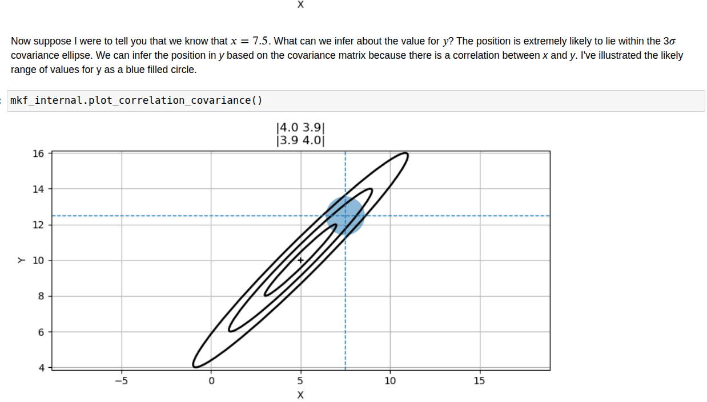

## Chapter 5: Multivariate Gaussians
- Extends Gaussians to multiple dimensions, and demonstrates how 'triangulation' and hidden variables can vastly improve estimates.
- [Chapter 5 Notebook](https://github.com/rlabbe/Kalman-and-Bayesian-Filters-in-Python/blob/master/05-Multivariate-Gaussians.ipynb)

## Points to remember
-  Multi variate Gaussians captures relationship b/w state variables
- Pg:156, Correlation & Covariance.
- +ve correlation means that if one variable is high, the other is likely to be high too. -ve correlation means that if one variable is high, the other is likely to be low. No correlation means that the variables are independent of each other. Height and weight are positively correlated.
- Pg:157-158 Cov math formula, how it generalises to variance. Example calculation (covariance). If Off-diagonal elements are zero, the variables are uncorrelated. -ve off-diagonal elements means that the variables are negatively correlated. +ve off-diagonal elements means that the variables are positively correlated.
- Pg:159 - use of (n-1) variance formula. [population vs sample]. We generally track the position of moving objects in continous space, hence the need to use sample variance formula. (n-1) is used to avoid bias in the estimate of the population variance and covariance. It corrects for the fact that we are estimating the population parameters from a sample. For estimators on smaller batch sizes (sample stats), we can expect a bias / error. This error approaches to zero, as the sample size increases. Hence, we use (n-1) to get an unbiased estimate of the population variance and covariance.

- Pg:160-161 -> +ve, -ve and no correlation (unfilled ellipse in 2D)

- Pg:162 To find Prob. of being at a point, we integrate surface to calculate volume (2D joint Probabilly)
- Pg:163 joint vs marginal Probability (Pg:164 sample plot, cut section view). Joint probability is the probability of two events happening at the same time. Marginal probability is the probability of a single event happening, regardless of the other event.
- Pg:171 Pearson correlation coefficient = Cov(X,Y) / (σx * σy) = Cxy. It is a measure of the linear correlation between two variables X and Y. It ranges from -1 to 1, where 1 means perfect positive correlation, -1 means perfect negative correlation, and 0 means no correlation.
- Having variables, that are correlated, can help us to improve our estimates of hidden variables. If x and y are correlated, then knowing the value of x can help us to better estimate the value of y, and vice versa.

- Independent variables have zero correlation, but zero correlation does not imply independence. (Pg:161)

- Pg:174 - Tracking aircraft using 2 radars uniform distribution (1 sensor update covariance reduces) But and orthogonal sensor: Better ↓ in Variance (consider sensor geometry too) as same direction Sensor would have given lesser reduction in covariance

- Pg:178 - Correlation can increase our knowledge of hidden variables. We introduce correlation using F,Q matrices. KF understands this and tries to infer correlation form F, Q
- Pg:181-182. Assuming CV model = prior (prediction) => correlated. But 2D Position measurement update is uncorrelated. Together they help in reducing Cor. (Whys and hows in Pg:182). Thus, having hidden variables in state vector, and having correlated variables, can help us to improve our estimates of hidden variables.

