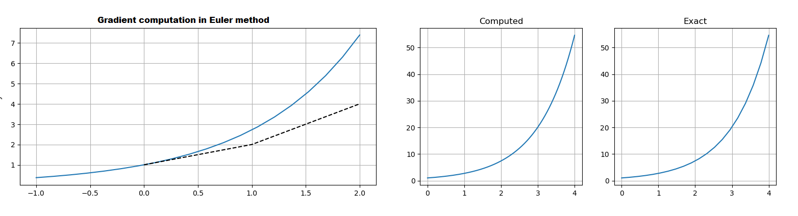
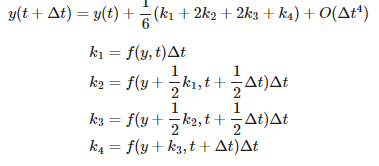
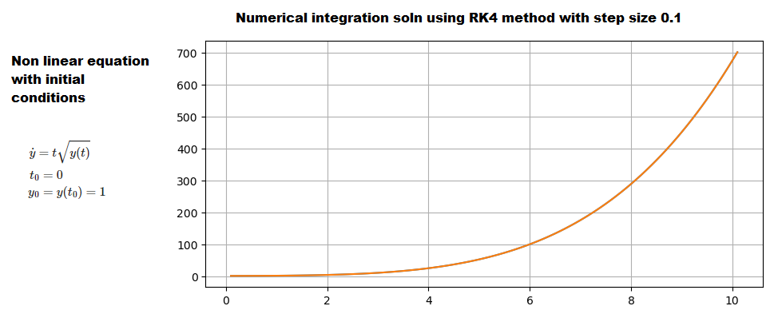

## Kalman Filter Math
- To write robust, numerically stable filters, or to read the literature, you will need to know the mathematical foundations of Kalman filter. Some sections will be required to understand the later chapters on nonlinear filtering.
- [Chapter 7 Notebook](https://github.com/rlabbe/Kalman-and-Bayesian-Filters-in-Python/blob/master/07-Kalman-Filter-Math.ipynb)

## Points to remember
- Pg:236 : x(t) = x_pred(t) + noise(t)
- `x_dot = Ax(t) + Bu(t) + w` is continous ODE form of physical system where w(t) = white noise. A = system dynamics matrix (continous space). Generally, A involves higher order differential equations. But, convert it to set of linear first order equations -> state space form
- `x_k = F * x_k-1 + B_k * u_k` is discrete form where **F=Transition matrix**, consisting of discete linear equations (not differential equations), transitions from x_k-1 to x_k over time step (delta_t). Finding this `F` matrix is very difficult. Closed form solution exists for simple ODEs
- Pg:237. Most system models involve set of Continous ODEs. For State space approach, convert to 1st order linear equations.
- Pg:239. 3. ways to find F (discrete) from A (continous)
    - Matris exponential - most often used
    - Linear Time Invalant theory
    - numerical techniques
- Pg:239. **1.Matrix exponential:** `x_dot = Ax`, can compute for equations having analysitcal solution. Solution is F = `e^At` computed using Taylour series. In Taylor series expansion, mostly `A^2` is 0, making any term later than 2nd term irrelevant. Hence, often, for Kalman filters, only 1st two terms matter. But even taylor series solution (and every other solution) involves numerical problems
- Need to consider time invariance. eg: aircraft losing weight due to burned fuel, but negligible for certain cases. Systems can be time dependent, finding analytical solutions for systems that change over time, is difficult and not straight forward.
- **2. LTI system theory** Laplace Transform.
- **3. Numerical solution**  - van Loan's method provides solution to finding both Fk, Qk for system, that can be described in `x_dot = Ax + Gw`, where G is white noise,
- Designing process noise matrix
    - Requires good understanding of control theory
    - we're modelling something which we have little knowledge of. Q is good, ass long as the model, that we use is good. But, we cannot model everything. Hence, we try to approximate by assigning some value to Q. if Q >>, then we trust measurements too much, if Q is <<, we trust predictions too much.
    - In `x_dot=Ax + Bu + w`, system inputs and outputs are continous w.r.t time. But Kalman filter is discrete (continous form exists, but not discussed here). So, we must find discretized version of the noise term (Q). It depends on what assumptions, we make of the behaviour of the noise
- Pg:243 Continous white noise model `x_dot=Ax + Bu + w` is  continous over time. For CA model, we assumd `a=0`. But we're modelling it using by assuming (a) changes by continous zero mean white noise. Hence delta_velocity averaged over time = 0
- Pg:244 Q = **[0 0 0; 0 0 0; 0 0 1] * phi** where phi = spectral density of white noise. Its difficult to compute analytically
- Pg:245 Piecewise White noise: (acceleration is constant for discrete timestep; and uncorrelated over time. But it varies across time -> it has a discontinous jump between each timestamp)
    - `f(x) = FX + gamma * w` - where gamma = [0.5 * delta_t^2; delta_t].
    - This approach allows us to specify Q in terms of sigma_v, the error, that we expect in motion, which is easier, intuitive, compared to finding the spectral density.
    - **sigma must be in range [0.5*delta_a, delta_a]**, where delta_a = maximum acceleration change b/w timestamps. (experimentally find out)
- In some cases, we might be able to get away with approximations for `Q`. Just a non-zero value for the variable, that is assumed to be undergoing noise - acceleration. Even, if we find exact solution - assuming either continous white noise, or piecewise white noise, result is similar
- Pg:247 Q-discrete white noise filterpy API
- **Pg:248 Stable computation for posterior (Joseph equation)**. Need to be careful about the approach, we're using to computing Posterior covariance.
- Pg:251 Numerical methods for integrating ODE. Matrix exp and Laplace transform okay for simple linear ODEs. `Complex math models => numerical methods`
- `x_dot=A*x => X_k = F * X_k-1. Numerical solution using Euler & RK4 methods`. Input is derivative of the system, expressed in `x_dot(t) = Ax(t)`, Output is x(t) -> what is the system state at time t, given we have A, and initial state x_0
- Pg:253 Derivative @ Pt. Taylor series 1st term alone used. Simple but delta_t needs to be small to work well or non linear ODEs.
- Eg : For simple `y=y^2` equation itself, a step size of 1 causes estimates to diverge, while we need >10000 iterations to compute good estimates (< 0.005)

- Pg:254-255, RK4 standard way to integrate ODE's with example" ODES
- Runge Kutta method formula

- Runge Kutta method example for Non linear problems

- Pg:256: Markov decision process assumption, Current state is dependent on Prev.state and transition prob. Essentially, we don't care about past states, with assumption that current state contains all variables of interest.
